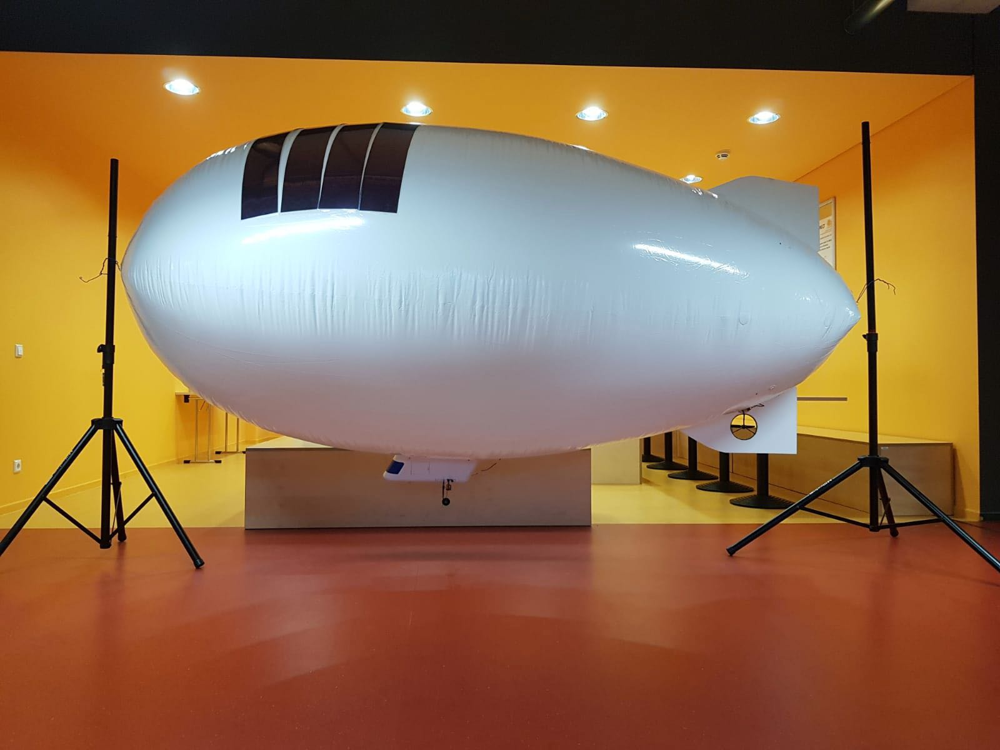
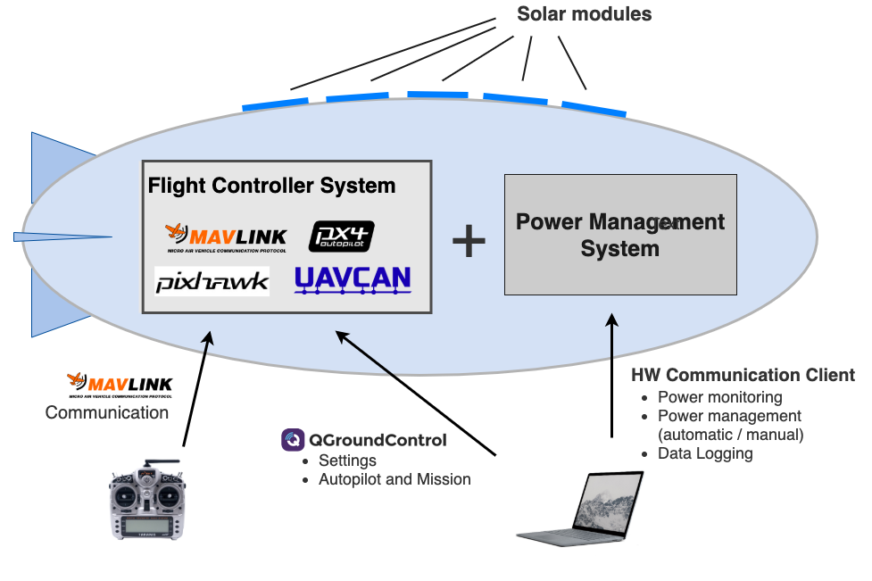
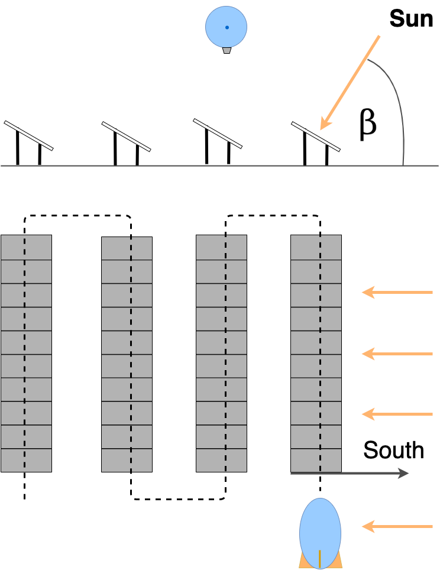
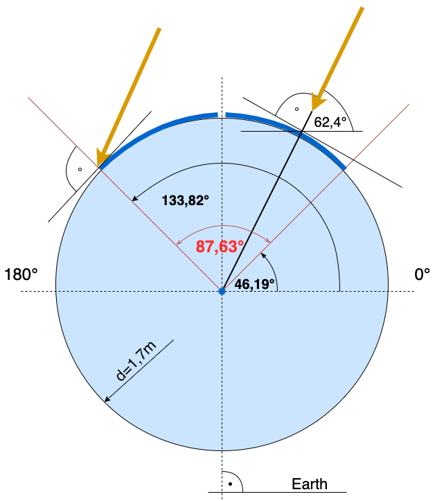
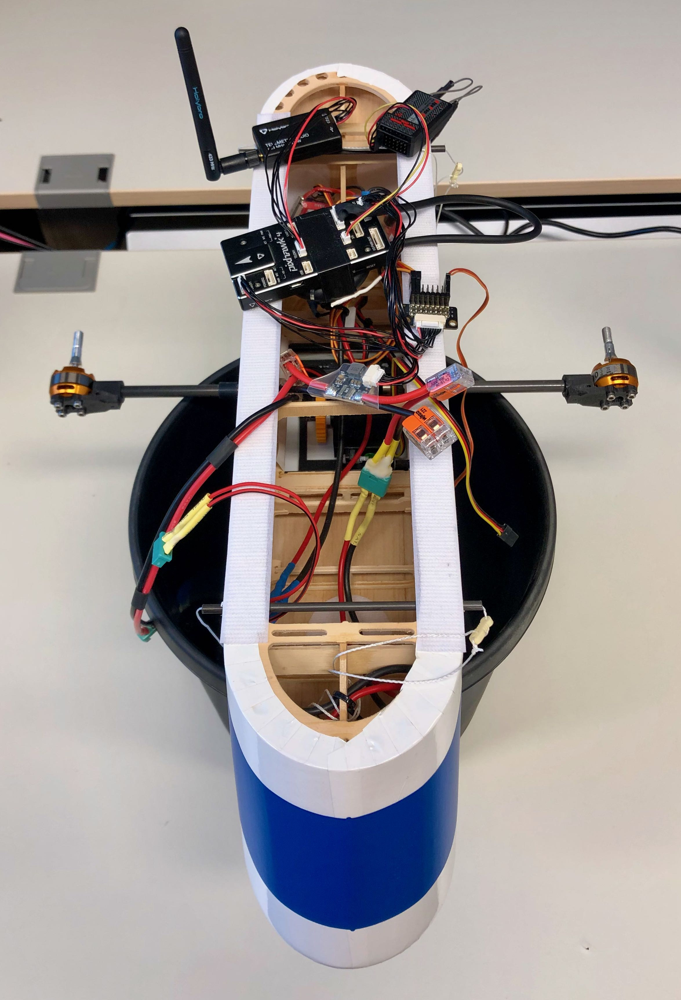
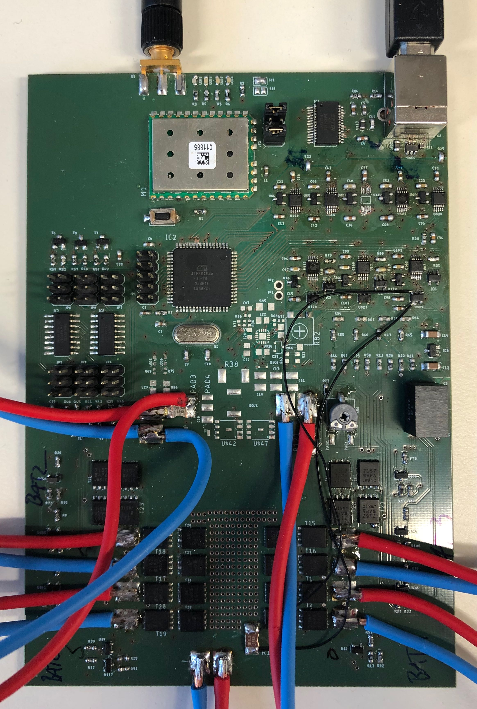
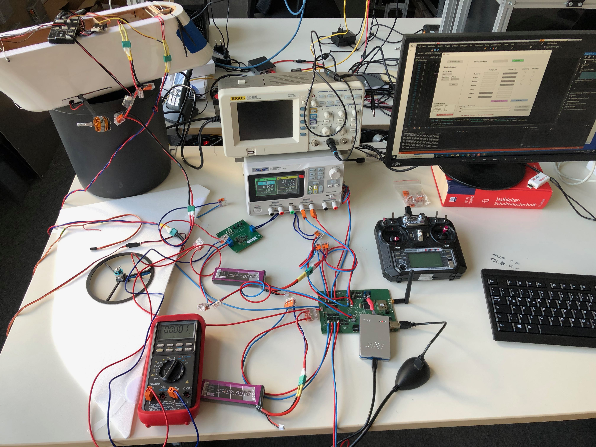
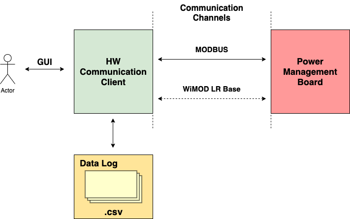

# bahpms

Thesis Project:  Development and Evaluation of a Hybrid Power Management System for Airships Intended for Infrared Thermographic Inspection of Photovoltaic Plants

## Airship Prototype

## Concept

### Inteded Mission
While vehcile monitors photovoltaic plants it will extend its flight time by charging itself with solar power.

## Gondola & Vehicle Control

## Hybrid Power Management System (HPMS)
Hardware which manages the charging process of the vehicle and switching between power supplies.

## Testing HPMS

## Hardware Communication Client on the Ground
### Concept

Wireless data exchange with vehicle hardware including charge states, charge rates, battery information (which is currently active and which is charged), manually switch between power supplies, etc.
